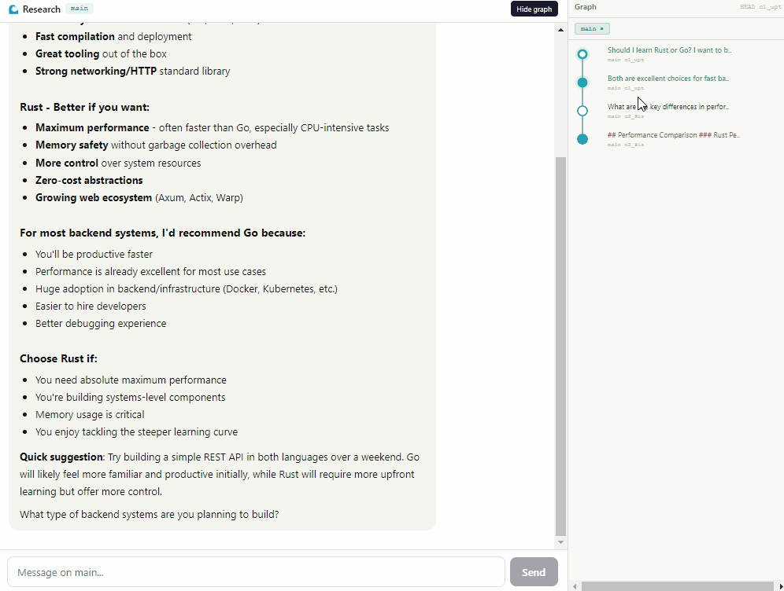
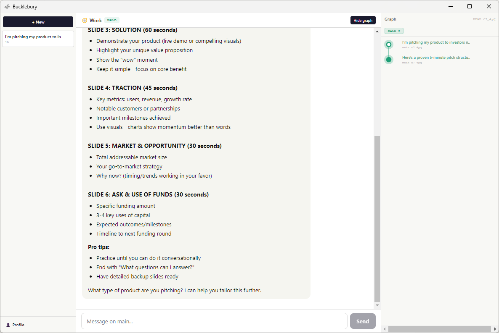
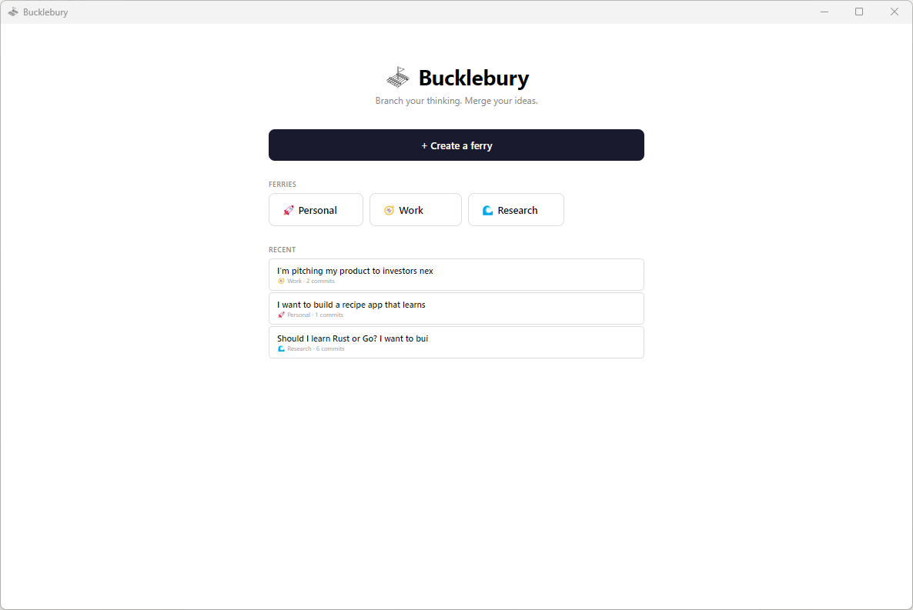

<p align="center">
  
</p>

<h1 align="center">Bucklebury</h1>

<p align="center">
  <em>Branch your thinking. Merge your ideas.</em>
</p>

<p align="center">
  <a href="https://github.com/your-username/bucklebury/releases/latest">Download for Windows</a> · macOS and Linux coming soon
</p>

---

<p align="center"></p>

<p align="center">
  
  
  
</p>

## What is Bucklebury?

A thinking tool that manages LLM conversations like Git. Every exchange is a commit. Branch to explore different directions. Merge to combine insights. See the shape of your reasoning as a graph.

*Named after Bucklebury Ferry from The Lord of the Rings. When thoughts get tangled and the Nazgul of complexity is chasing you — branch, don't go the long way around.*

## Features

- **Branch / Edit** — Rewrite any prompt to explore a different direction. Same parent, new branch.
- **Merge** — Select commits from different branches and combine them into a unified response.
- **Graph View** — See your entire conversation as a DAG. Click nodes to navigate. Hover to highlight.
- **Ferries** — Organize conversations into projects. Each ferry has its own API key and storage path.
- **BYOK Multi-Provider** — Bring your own API key. Supports Anthropic, OpenAI, and Gemini. Auto-detected from key format.
- **Local .md Storage** — All conversations saved as Markdown files with YAML frontmatter. Your data, your files.
- **Obsidian Compatible** — Open your storage folder in Obsidian and browse conversations with full metadata.

## How It Works

| Concept | What it means |
|---------|--------------|
| **Commit** | A prompt + response pair. The atomic unit of conversation. |
| **Edit** | Rewrite a prompt from the same parent. Creates a new branch. |
| **Branch** | A divergent path of thinking from any commit. |
| **Merge** | Combine context from multiple branches into one response. |
| **Graph** | Visual DAG showing the structure of your thinking. |
| **Ferry** | A project space containing multiple conversations. |

## Download

| Platform | Status |
|----------|--------|
| Windows | [Download .exe](https://github.com/your-username/bucklebury/releases/latest) |
| macOS | Coming soon |
| Linux | Coming soon |

## Development

```bash
# Install dependencies
npm install

# Run in development mode
npm run electron:dev

# Build for Windows
npm run electron:build:win
```

See [DEVELOPMENT.md](DEVELOPMENT.md) for the full development environment setup guide.

## Spec

The full product spec and design philosophy is in [bucklebury-spec.md](bucklebury-spec.md).

## License

[MIT](LICENSE)
